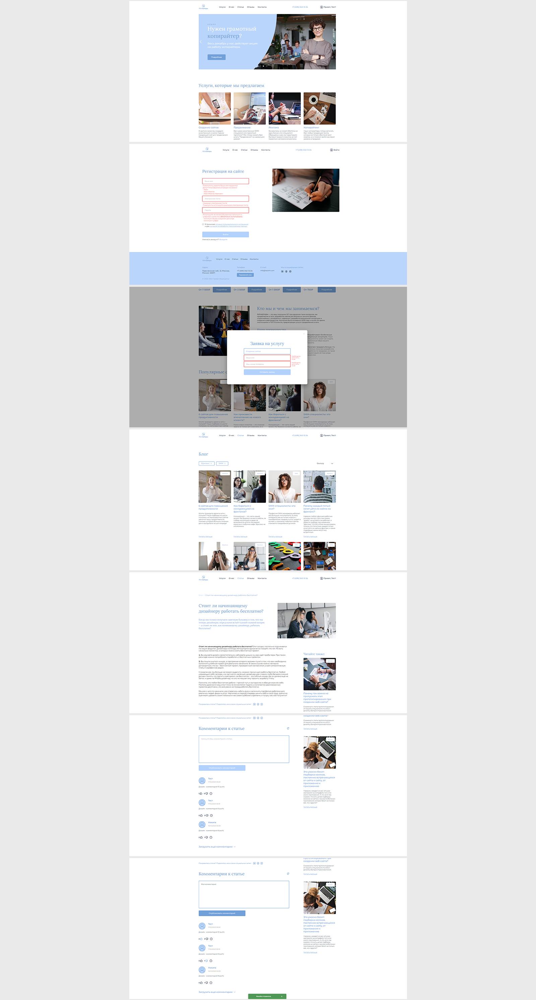

# Веб-приложение - информационный сайт-блог веб-студии

Самостоятельно выполненный проект выполнен в рамках обучения на курсе "Профессия Frontend-Разработчик" в онлайн-школе "Айтилогия".

## Внешний вид

## Выполненные задачи:
- Реализация frontend-части SPA в соответствии с техническим заданием, макетом и предоставленным UI Kit;
- Практика создания SPA с использованием фреймворка Angular;
- Практика использования встроенных средств Angular (разделение приложения на компоненты, модули, сервисы);
- Применение в проекте lazy loading, guards, interceptors, RxJS;
- Реализация валидации необходимых полей приложения;
- Практика использования спецификации для API в формате .yaml с сервисом editor.swagger.io;
- Практика использования Postman для работы с запросами на backend.

## Возможности:
* Регистрация, авторизация пользователя;
* Оставление заявки на услугу;
* Просмотр статей, их фильтрация по тегам;
* Пагинация;
* Комментирование статей (для авторизованного пользователя);
* Оставление реакций и жалоб на комментарии (для авторизованного пользователя).

## Используемые технологии:
* Angular 16 (HTML, SCSS, TypeScript)
* Angular Material
* ESLint
* RxJS
* Jasmine
* Karma
* JWT-Авторизация
* MongoDB
* Доп. библиотеки (ngx-owl-carousel, ngx-mask)
* Используется заранее подготовленный backend на node.js